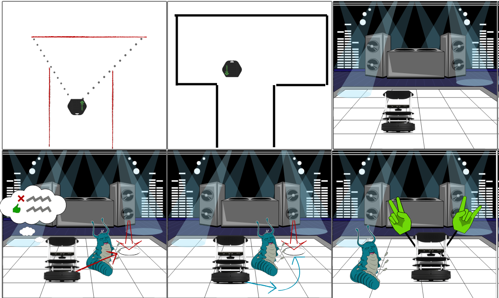
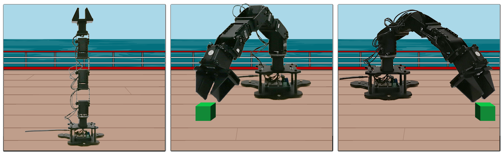
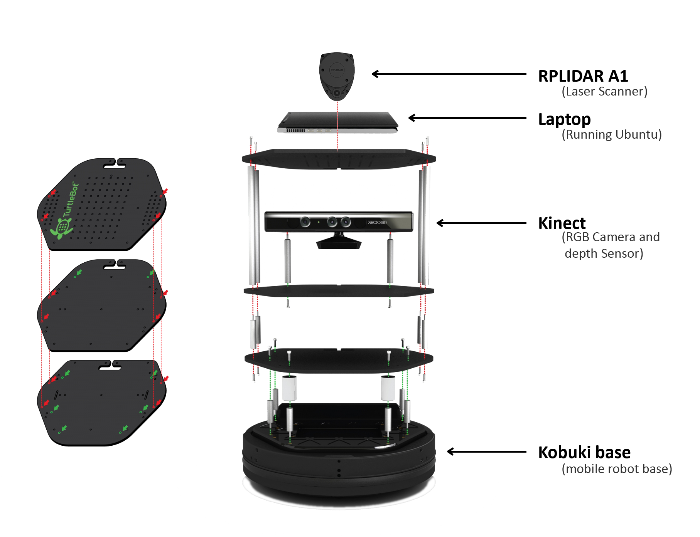
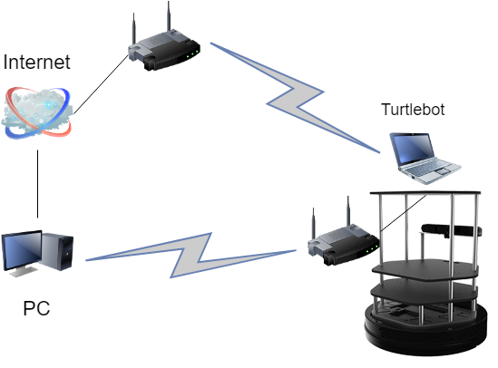
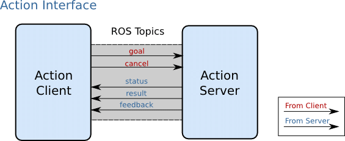
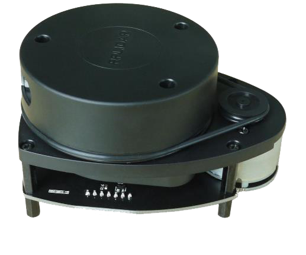
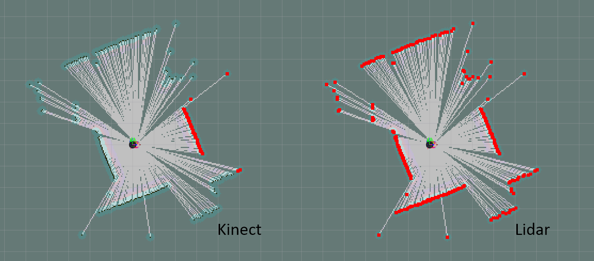
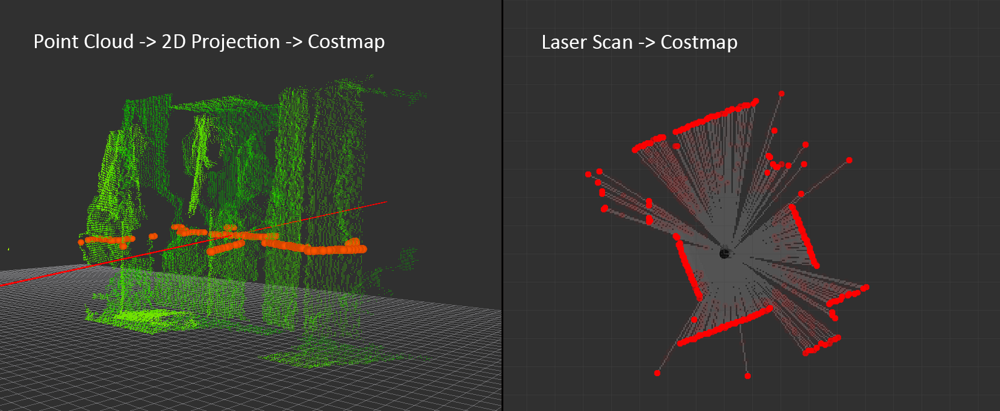

[Video Link](https://youtu.be/mqFVNOJ0VU0 "vide link")

----------
**TAble of Contents**
- [Introduction](#introduction)
  - [Objectives](#objectives)
  - [Project description](#project-description)
  - [Definitions](#definitions)
  - [Environment description](#environment-description)
  - [ROS](#ros)
  - [ROS communication protocol](#ros-communication-protocol)
  - [ROS Packages](#ros-packages)
  - [Hardware description](#hardware-description)
  - [Network setup](#network-setup)
  - [Installation](#installation)
- [I: Motion Control.](#i-motion-control)
  - [Basic Motion of Mobile Base Mobile Base Control with Low-Level Programming.](#basic-motion-of-mobile-base-mobile-base-control-with-low-level-programming)
  - [Advanced Motion of Mobile Base Mobile Base Control with Higher-Level Programming.](#advanced-motion-of-mobile-base-mobile-base-control-with-higher-level-programming)
  - [Navigating a Square using Twist+Odometry.](#navigating-a-square-using-twistodometry)
  - [Navigation with Path Planning -\> movebase.](#navigation-with-path-planning---movebase)
    - [Actionlib.](#actionlib)
    - [Movebase.](#movebase)
    - [Action API.](#action-api)
- [II: Planar Laser RangeFinder.](#ii-planar-laser-rangefinder)
  - [Slamtec RPLIDAR A1](#slamtec-rplidar-a1)
    - [Specifications](#specifications)
  - [Setting up and testing the RPLIDAR A1](#setting-up-and-testing-the-rplidar-a1)
    - [Notes](#notes)
  - [Launch Files](#launch-files)
- [III: Navigation and Localization](#iii-navigation-and-localization)
  - [Map Building using GMAPPING](#map-building-using-gmapping)
  - [map\_server](#mapserver)
  - [Navigation Stack](#navigation-stack)
    - [Planner and Costmap](#planner-and-costmap)
      - [Global and Local Navigation](#global-and-local-navigation)
    - [Costmap](#costmap)
      - [Footprint](#footprint)
      - [Marking and Clearing](#marking-and-clearing)
      - [Inflation](#inflation)
  - [Navigation in a known map](#navigation-in-a-known-map)
    - [AMCL](#amcl)
    - [Changes](#changes)
      - [Launch file](#launch-file)
      - [Costmaps](#costmaps)
  - [Autonomous exploration](#autonomous-exploration)
  - [Frontier exploration](#frontier-exploration)
  - [Notes](#notes-1)
  - [Running](#running)
- [Robotic arm](#robotic-arm)
  - [Calibration](#calibration)
  - [Changes to the packages](#changes-to-the-packages)
  - [Notes](#notes-2)
- [Encountered problems and solutions](#encountered-problems-and-solutions)
- [Conclusion.](#conclusion)
- [Bibliography](#bibliography)
----------

University of Burgundy

Robotic Engineering 2 - ROS PROJECT


<span>**Report**</span>


**Authors**

Sylwia Bakalarz

Arsanios Mikael

Lasse Mackeprang


**Supervisors**

Ralph SEULIN

Marc BLANCHON

Raphael DUVERNE

Thibault CLAMENS


Introduction
============

Objectives
----------

First Objective.
:
    Motion Control.

Second Objective.
:
    Planar Laser RangeFinder.

Third Objective.
:
    Navigation & Localization.

Fourth Objective.
:
    Robotic Arm.

Project description
-------------------

The purpose of the project was to familiarise with a unified and open
source
programming framework for controlling robots, which is ROS. The **First
phase** of it was to learn the basic concepts, work on tutorials and
practice.

In the **Second phase**, by implementing the acquired knowledge, we
learned how to control a mobile base at different levels of abstraction.
We began with motor drivers and wheel encoders, and proceeded upward to
path planning and map building. Secondly we switched from kinect visual
sensor to rplidar and tested its efficiency in building a map. Finally,
with the help of available resources, turtlebot2 could be navigated in a
known map either by selecting 2D Navigation Goals in Rviz or running a
custom created script with hard coded positions in the map. Navigation
in the known map included obstacle avoidance.



**Third phase** of the project focused on PhantomX Pincher Robot Arm.
Robotic arm was fixed on a table with a kinect camera. The scenario for
was called “Pick and Place” like shown in the storyboard.



Each part of the project was implemented through packages, python
scripts and custom launch files.

Definitions
-----------

Node:
:   A computational process. Nodes communicate with each other using
    topics or services. ’rosnode’ is a command that displays information
    about the nodes.

Topic:
:   A channel through which messages travel. Nodes publish/subscribe to
    topics.

Messages:
:   Instructions published by nodes to topics.

Master:
:   It is essential for the nodes to locate one another.

rosout:
:   The console log reporting mechanism in ROS.

roscore:
:   A command that activates a master with essential components.

Environment description
-----------------------

ROS
---

ROS is an open-source Robot Operating System -\> robotic middleware. It
provides services including hardware abstraction, low-level device
control, implementation of commonly-used functionality, message-passing
between processes, and package management. It also provides tools and
libraries for obtaining, building, writing, and running code across
multiple computers.

ROS communication protocol
--------------------------

A node publishes a message to a given topic, another node can subscribe
to the topic and perform some operation. There may be multiple
concurrent publishers and subscribers for a single topic, and a single
node may publish and/or subscribe to multiple topics. In general,
publishers and subscribers are not aware of each others’ existence.

Communication using topics is not always the best solution as the data
has to be constantly published. Another solution is provided by
services, which is request/reply based. A providing node offers a
service under a name and a client uses the service by sending the
request message and awaiting the reply.

Bags are an important mechanism for storing data, such as sensor data,
that can be difficult to collect but is necessary for developing and
testing algorithms.

ROS Packages
------------

-   **mbot\_motion**

    -   *dependencies*

        -   rospy: Python client library

        -   actionlib: api for preemptable tasks like moving the base to
            a target location

        -   visualization\_msgs: visualizing markers in rviz

        -   tf: keep track of multiple coordinate frames over time

        -   geometry\_msgs: messages for common geometric primitives
            such as Twist

    -   *imported*

        -   transform\_utils from rbx1 for Quaternion angle conversion

-   **mbot\_nav**

    -   *dependencies*

        -   turtlebot\_navigation: demos of map building using gmapping
            and localization with amcl, while running the navigation
            stack.

        -   turtlebot\_gazebo: 3d environment simulation for turtlebot.

        -   frontier\_exploration: frontier based exploration of unknown
            environments extending on the existing navigation stack.

    -   *modified*

        -   **amcl.launch** *from turtlebot\_navigation*

            -   takes a bool argument “onlaptop” to determine if the
                launch file is run from workstation or turtlebot(laptop)

            -   3d sensor scan topic is changed to kinect\_scan to
                prevent interference with lidar scan topic

            -   default map is set to the lab map

            -   loads a modified Move base launch file

        -   **move\_base.launch.xml** *from turtlebot\_navigation*

            -   loads a modified **common\_costmap\_params.yml**, with
                *map\_type* as costmap instead of voxel to match lidar
                scan data and *max\_obstacle\_height* as 1.0 instead of
                0.35 inside the obstacle layer to compensate for the
                lidar height from the ground, *inflation\_radius* was
                reduced to 0.3 from 0.5 this made the autonomous
                navigation easier in narrow passages

            -   loads modified **local\_costmap\_params.yaml**,
                *map\_type* was changed to costmap instead of voxel to
                match lidar scan data, and the map size was changed to
                6x6

            -   loading modified **global\_costmap\_params.yaml**, map
                type was changed to costmap instead of voxel to match
                lidar scan data

    -   *created*

        -   Two maps were generated, one using lidar scan data, and the
            other using kinect, subsequently the lidar map was cleaned
            and adjusted

        -   **dance.py**: A navigation script with hardcoded navigation
            points in the lab map

        -   **auto\_mapping.launch**: A Launch file for frontier
            exploration with optional simulation, turtlebot gmapping,
            modified move with custom planner configuration to disable
            recovery protocols

        -   **explore.launch.xml** that contains the default client and
            a server with the modified *common\_costmap\_params.yml*.

        -   **simple\_explore\_client.py** A script to run unbounded
            exploration

Hardware description
--------------------



Network setup
-------------


The room is setup so that each Workstation is paired with a Turtlebot.
The Workstation is connected to the internet via Ethernet, while the
Turtlebot has to be connected to an access point if internet is needed.
The Workstation and Turtlebot are connected to an additional private
network over a wireless router placed on the Turtlebot itself, this
network is used by ROS. On every private Turtlebot network, the
Workstation has a static IP **192.168.0.100** and the Turtlebot’s IP
**192.168.0.200**.



On the Workstation it is important to set correct environment variables.
This depends on where roscore will be running, **ROS\_MASTER\_URI** can
be set to URI of the master by running *export ROS\_MASTER\_URI=\<URI\>*
or permanently by appending the same line to the .bashrc file on the
Workstation.

Installation
------------

Inside your catkin\_ws/src folder

``` {.shell}
git clone --recurse-submodules https://github.com/koalasession/BSCV5_RobEng2.git
```

then in your catkin\_ws folder.

``` {.python}
catkin_make
```

I: Motion Control.
==================

Basic Motion of Mobile Base Mobile Base Control with Low-Level Programming.
---------------------------------------------------------------------------

Low level motion control is giving the robot a speed, angle and angular
velocity. This level of commands to the robot does not care about
odometry, the robot does not know where it is or how much it moved.

ROS uses the Twist message type for publishing motion commands.
The topic to which it publishes messages is called cmdvel (“command
velocities”). The base controller node subscribes to the /cmdvel topic
and translates Twist messages into motor signals that turns the wheels.

To move straight ahead with a speed of 0.1 meters per second would
require a Twist message with linear values x=0.1, y=0 and z=0, and
angular values x=0, y=0 and z=0. Twist message can be sent on the
command line, the message part would take the form:

``` {.python}
`{linear: {x: 0.1, y: 0, z: 0}, angular: {x: 0, y: 0, z: 0}}`
```

The larger the angular z value compared to the linear x value, the
tighter the turn.

More efficient way of sending the messages is by using nodes, which can
be created within a ROS package with the following dependencies: rospy,
geometrymsgs.

Advanced Motion of Mobile Base Mobile Base Control with Higher-Level Programming.
---------------------------------------------------------------------------------

In this part of the project odometry information was used to determine
the distance that has been travelled. The odometry controller, which
publishes all its information into the transform tree, which is
accessible using the Transform Library, has to be running.

The a ROS package was required the following dependencies: rospy,
geometrymsgs and tf.

Navigating a Square using Twist+Odometry.
-----------------------------------------

This part of the project’s was to navigate turtlebot to move in a square
using Twist messages and odometry.

Odometry estimation of displacement is added layer on top of Twist.
Information gathered to control the base concerns not only linear and
angular velocity but also displacement and orientation.

Odometry used data from motion sensors to estimate change in position
over time or estimate the relative position to a starting location. The
method appeared to be inaccurate due to the inadequate update frequency
or measuring errors.

``` {.python}
    # Loop for 4 side of the square.
    for i in range(4):
        # creates a Twist message with linear values.
        msg = Twist()
        msg.linear.x = linear_velocity
        # Get the starting position values
        (position, rotation) =
        get_odom(tf_listener, odometry_frame, base_frame)
        x_start = position.x
        y_start = position.y
        # Keep track of the distance traveled
        distance = 0
        # publish until the goal distance is reached
        while distance < goal_distance:
            pub.publish(msg)
            rate.sleep()
```

Navigation with Path Planning -\> movebase.
-------------------------------------------

Move base is a layer on top of odometry. Turtlebot2, given a location
and orientation on the map(if there were no dynamic obstacles), can find
the path and moves towards it automatically.

### Actionlib.

The actionlib stack provides a standardized interface for performing
tasks. Like for example, moving the base to a target location or
performing a laser scan.

The action client and server communicate with each other using a
predefined action protocol. This action protocol relies on ROS topics in
a specified ROS namespace in order to transport messages.

### Movebase.

The movebase package provides an implementation of an actionlib package
that, allows the turtlebot2 to reach a navigation goal.
The movebase node links together a global and local planner to
accomplish its global navigation task.
The movebase node also maintains two costmaps, one for the global
planner, and one for a local planner (see the costmap2d package) that
are used to accomplish navigation tasks.

### Action API.

The movebase node provides an implementation of the SimpleActionServer
that takes in goals containing geometrymsgs/PoseStamped messages. The
recommended way to send goals to movebase is by using the
SimpleActionClient (allows tracking the status).



**Navigating a square using move base**

``` {.python}
 # Initialize a counter to track waypoints
    i = 0
    # Cycle through the four waypoints
    while i < 4 and not rospy.is_shutdown():
        # Update the marker display
        # self.marker_pub.publish(self.markers)
        # Intialize the waypoint goal
        goal = MoveBaseGoal()
        # Use the map frame to define goal poses
        goal.target_pose.header.frame_id = 'map'
        # Set the time stamp to "now"
        goal.target_pose.header.stamp = rospy.Time.now()
        # Set the goal pose to the i-th waypoint
        goal.target_pose.pose = waypoints[i]
        # Start the robot moving toward the goal
        self.move(goal)
        i += 1
```

II: Planar Laser RangeFinder.
=============================

Slamtec RPLIDAR A1
------------------

A low cost LIDAR sensor suitable for use in indoor SLAM operation. It
provides a 360 degree scan field with a guaranteed range of 8 meters.
RPLIDAR supports full integration with ROS and has multiple packages
ready to use.

### Specifications

Under ideal conditions:

-   12 meter range

-   8000 samples/second

-   1 degree angular resolution

-   0.2 cm distance resolution

-   2-10 hz rotation frequency

-   Price 99\$ ([dfrobot.com](dfrobot.com))

 

Setting up and testing the RPLIDAR A1
-------------------------------------

The LIDAR can be used out of the box with minimal setup by downloading
and installing the packages rplidar\_ros and turtlebot\_le2i.
In the catkin\_ws/src directory clone and build.

``` {.python}
git clone https://github.com/roboticslab-fr/
rplidar-turtlebot2.git
```

### Notes

-   **roslaunch turtlebot\_le2i rplidar\_3dsensor.launch** is a copy of
    **turtlebot\_bringup 3dsensor.launch** with the scan topic remapped
    to kinect\_scan

-   The lidar can be used with the ROS by example code (refer to vol. 1
    chapter 8.5 and 8.5.2) to transverse a known map.

``` {.python}
roslaunch turtlebot_le2i remap_rplidar_minimal.launch
roslaunch rbx1_nav tb_demo_amcl.launch map:=<map_name>.yaml
```

``` {.python}
rosrun rviz rviz -d `rospack find rbx1_nav`/nav_test.rviz
```

Launch Files
------------

There are a lot of useful things we can figure out by looking at the
turtlebot\_le2i package regarding how the LIDAR setup is performed, and
since it worked on our Turtlebot there are a lot of things we can use
straight from this package. Some important aspects when creating your
own package are the URDF files used to describe the robot. This includes
its dimensions, placement of sensors, frames of references and
kinematics. The urdf file is written in XML format, which can be
simplified using a xacro, and is used to describe where the LIDAR is
placed and its size, we can most likely just use the rplidar.urdf.xacro
provided by the package installed and used to test the laser. The launch
files can be edited to launch only the things we need and again the
bringup files from the downloaded package can be a nice reference.

III: Navigation and Localization
================================

After generating a map, the turtlebot localizes itself using the
navigation stack against the map. When the turtlebot receives a
destination goal, a path planner creates a global path to the
destination. Along the way it provides short term goals, which help to
avoid obstacles and adjust the speed, and angular velocity. In case the
robot gets stuck a recovery behaviour is performed.
There are two ways of exploring an environment, using teleoperation with
different input devices, or autonomous mapping like frontier exploration

Map Building using GMAPPING
---------------------------

``` {.python}
roslaunch turtlebot_le2i rplidar_minimal.launch
roslaunch turtlebot_le2i rplidar_3dsensor.launch
roslaunch turtlebot_navigation gmapping_demo.launch
```

``` {.python}
roslaunch mbot_nav navigation_joystick.launch
```

map\_server
-----------

To create the map we have to use the map\_server ROS node. This node
offers map data as a ROS service and also provides the map\_saver
utility which allows dynamically generated maps to be saved to file. The
basic usage of map\_server is as follows:

``` {.python}
rosrun map_server map_saver -f /tmp/my_map
```

The saved map is written to two files. A .yaml file that describes the
map meta-data and points to a .pgm image file. The image file can be
viewed and edited to clean up the map by removing unwanted pixels or
close off sections using black lines. A map can also be created from Bag
data.

Navigation Stack
----------------

We can say that the navigation stack consists of layers of packages each
one providing an additional level of abstraction. The job of navigation
stack is to produce a safe path for the robot to execute, by processing
data from odometry, sensors and environment map. Understanding the
configuration and different parameters of the configuration stack is
crucial to minimize the amount of time spent on development and the
performance of the algorithm or strategy.


### Planner and Costmap

#### Global and Local Navigation

The global navigation is used to create paths for a goal in the map or
at a far-off distance The local navigation is used to create paths in
the nearby distances and avoid obstacles, for example, a square window
of 4 x 4 meters around the robot.

### Costmap

The costmap package builds a 2d Occupancy Grid like a map, and inflates
costs in a 2D costmap based on the occupancy grid and a user specified
inflation radius. Global costmap is generated by inflating the static
map provided by the map server in the navigation stack, the inflation
radius is relative to the footprint of the robot and user specified
parameters. Local costmap is generated by inflating obstacles detected
by the robot’s sensors in real time.

#### Footprint

Footprint is the contour of the mobile base. In ROS, it is represented
by a two dimensional array of the form [x0, y0], [x1, y1], [x2, y2],
...]. This footprint will be used to compute the inflation of obstacles
in a way that fits this robot. Usually for safety, we want to have the
footprint to be slightly larger than the robot’s real contour. To
determine the footprint of a robot, the most straightforward way is to
refer to the drawings of your robot.

#### Marking and Clearing

The costmap automatically subscribes to sensors topics over ROS and
updates itself accordingly. Each sensor is used to either mark (insert
obstacle information into the costmap), clear (remove obstacle
information from the costmap), or both. A marking operation is just an
index into an array to change the cost of a cell ranging from 0 to 255.

#### Inflation

Inflation is the process of propagating cost values out from occupied
cells that decrease with distance. For this purpose, there are 5 levels
of costmap values:

-   Lethal : meaning there is definitely an actual obstacle that will
    result in certain collision

-   Inscribed : means that a cell is less than the robot’s inscribed
    radius away from an actual obstacle. So the robot is certainly in
    collision with some obstacle if the robot center is in a cell that
    is at or above the inscribed cost.

-   Possibly circumscribed : similar to inscribed, but using the robot’s
    circumscribed radius as cutoff distance. Thus, if the robot center
    lies in a cell at or above this value, then it depends on the
    orientation of the robot whether it collides with an obstacle or
    not.

-   Freespace : assumed to be zero, and it means that there is nothing
    that should keep the robot from going there

-   Unknown : there is no information about a given cell

Assigning a value between “Freespace” and “Possibly circumscribed”
depends on their distance from a “Lethal” cell and the decay function
provided in the configuration
To see the local costmap in rviz set the topic to:

``` {.python}
/move_base_node/local_costmap/costmap
```

To see the global costmap in rviz set the topic to:

``` {.python}
/move_base_node/global_costmap/costmap
```

Navigation in a known map
-------------------------

### AMCL

AMCL is a ROS package that deals with robot localization in relation to
a map, it uses a laser scanner and transform messages to estimate
location on a map. The localization is integrated in ROS by emitting a
transform from a map-frame to the odom frame that “corrects” the
odometry. To query the robot position according to the localization you
should ask the transform of base\_footprint in the map frame. This is
different from dead reckoning, Odometry based robot navigation means how
to make use only of the odometry to understand where the robot is. That
is dead reckoning navigation.

### Changes

#### Launch file

The scan topic of 3dsensor inside *amcl.launch* file was changed to
kinect\_scan to avoid flickering of the scan topic between Lidar and
Kinect



#### Costmaps

map\_type is set as costmap instead of voxel to match lidar scan data.
Voxel map type is a 3d Point cloud that is projected to 2D and then
translated to the costmap, the Lidar scan data can be translated
directly to costmap.



*max\_obstacle\_height* is set to 1.0 instead of 0.35
inside the obstacle layer because the Lidar height from the ground is
greater than the Kinect’s height. Otherwise the Obstacle layer will not
record any obstacles.


``` {.python}
roslaunch turtlebot_bringup minimal.launch
roslaunch turtlebot_navigation amcl_demo.launch
map_file:=`rospack find mbor_nav`/maps/map_lidar.yaml
```

``` {.python}
roslaunch turtlebot_rviz_launchers view_navigation.launch
```

Autonomous exploration
----------------------

In a completely unknown environment, a robot’s task is to explore the
area and make a map. It set navigation goals along the way according to
the map and the robot position.
An algorithm and a strategy is developed in order to correctly explore
and map unknown parts of the map.

Frontier exploration
--------------------

Frontier expliration is a ROS package made for exploring unknown
environments and neeeds a map server running to update itself. Executing
a frontier exploration task can be achieved by a user-defined polygon
area either through rviz or ExploreTaskAction service. The exploration
goal contains an initial point to start exploration, and a polygonal
boundary to limit the exploration scope. To run an unbounded exploration
task, simply leave the boundary blank.

**The script in python for Frontier Exploration:**

``` {.python}
client = actionlib.SimpleActionClient(
        'explore_server',
        ExploreTaskAction)
    client.wait_for_server()

# empty polygon
polygonStamped = PolygonStamped()
polygonStamped.header.frame_id = 'map'
polygonStamped.header.stamp = rospy.Time.now()
# starting point from turtlebot position
initialGoal = PointStamped()
initialGoal.header.frame_id = 'map'
initialGoal.point = Point32(x=0, y=0, z=0)

# unbounded exploration, uncomment for bounded
# for x, y in zip(self.points_x, self.points_y):
#    polygonStamped.polygon.points.append(
#        Point32(x=x, y=y, z=0))

# setting exploration goal
exploration_goal = ExploreTaskGoal()
exploration_goal.explore_boundary = polygonStamped
exploration_goal.explore_center = initialGoal

# starting exploration
client.send_goal(exploration_goal)
```

Notes
-----

-   The package is buggy and has been updated in later versions of ROS

-   In environments that contain a lot of small width objects like chair
    and desk legs, the navigation behaves in an erratic way

-   Initial clearing with a Twist rotation message is required to avoid
    immediate failure

-   Recovery protocols are disabled to avoid random clearing with no
    necessity

-   This package with Lidar is better used in walls only environment or
    a closed maze

Running
-------

``` {.python}
roslaunch turtlebot_le2i rplidar_minimal.launch
roslaunch mbot_nav auto_mapping.launch
```

``` {.python}
roslaunch turtlebot_rviz_launchers view_navigation.launch --screen
```

Robotic arm
===========

The PhantomX Pincher Robot Arm is a 4 degree-of-freedom robotic arm,
easily added to the ROS platform. It has a range of 30 centimeters from
its base and consists of 5 actuators in frame and an ArbotiX
Robocontroller for on-board processing. The gripper can lift up to 250
grams. The arm was already assembled when we started to work on it, and
it had been set up on a table with a top view from a kinect.

Calibration
-----------

For the arm to be able to pick up a cube, the arm had to be calibrated
to obtain a transform in relation to the kinect. This process just
required a correct setup.

A printed checker-board input underneath the camera in range of the arm,
and the following two files were launched:

``` {.python}
roslaunch turtlebot_arm_bringup arm.launch
roslaunch turtlebot_arm_kinect_calibration calibrate.launch
```

Once the camera has located the checker-board a picture popped-up with
four corners of the checker-board marked with numbers. The edge of the
left side of the gripper was then put on the number specified by the
console, and you follow it’s directions. Once the steps were done, the
transform was printed to copy. This transform can be put in the
block\_manip\_complete.launch file:

``` {.cpp}
<node pkg="tf" type="static_transform_publisher"
name="static_transform_publisher"
args="0.16642 -0.152942 1.00053 -0.344048 0.394775 0.610077 0.594633 /base_link /camera_link 100"/>
```

or published to a topic:

``` {.python}
rosrun tf static_transform_publisher -0.26683
-0.122903 -0.537733 0.5 -0.499602 0.5 0.500398
/arm_base_link /openni_camera 100
```

After the calibration the demo, which includes bringups for everything
needed, such as the Robot Arm, MoveIt!, kinect, block manipulation and
RViz, could be launched:

``` {.python}
roslaunch turlebot_arm_block_manipulation
block_manip_complete.launch
```

Changes to the packages
-----------------------

**mbot\_arm**

In
*turtlebot\_arm\_block\_manipulation/demo/block\_manip\_complete.launch*
under the kinect bringup the following argument was added:
* \<arg name=“depth\_registration” default=“true” /\>*
This makes the kinect start up with the factory calibration of the depth
camera and fixes the skew between the colour and depth images.

In
turtlebot\_arm\_block\_manipulation/src/block\_detection\_action\_server.cpp

``` {.cpp}
#include <ros/package.h>
std::string path = ros::package::getPath
("turtlebot_arm_block_manipulation") + "/pcd_files/";
```

was added and all static references to the mscv user was replaced by
this path. The directory was added to the package as well. This ensured
that no matter which user runs the launch file the pcd-files will be
saved in a directory in this package.
RVis could then be launched with it’s ”Fixed Frame” reference being the
robot arm’s ”base\_link”, which was solely a cosmetic change.

**Integration with turtlebot**

The package is used for the robot arm to pick up a green cube from a
turtlebot when it transmits a message to a specific topic. This could be
after a successful rendezvous, alternatively the scanning process can be
started manually by publishing to this topic:

``` {.python}
rostopic pub -r 1000 /relay/robot_status2 std_msgs/String
"vsdone"
```

This message starts a scan. After a cube is found the colour of the cube
is checked. Once a green cube has been found, the pick and place program
is started and in return, it picks up the cube from the turtlebot and
puts it at a hard-coded place on the table. The program is then
terminated.

Notes
-----

-   Permissions for read writing and executing has to be enabled for the
    arm to work:

    ``` {.python}
    sudo usermod -a -G dialout user
    ```

    works best on a mono colour surface, as it will be easier to detect
    the colour of the cube

    **Result**
        Managed to pick up a cube after manually transmitting the ”vsdone”
    message we had the potential to work further on incorporating the
    arm in our project if time allowed.
        The modified package can be found inside mbot\_arm.

-   In the BSCV5\_RobEng2 repository mbot\_arm is a reference to another
    github repo. To include the repository when cloning add
    *–recurse-submodules* as an option:

    ``` {.python}
    git clone --recurse-submodules https://github.com/koalasession/BSCV5_RobEng2.git
    ```

Encountered problems and solutions
==================================

-   The Turtlebot would behave erratically and th tf tree would break,
    this error was not easy to detect, the solution was to restart the
    kobuki base itself.

-   Getting stuck: The turtlebot can get stuck even after performing the
    basic recovery protocol.

-   Reality vs simulation: there are factors in real life that are not
    simulated. eg: the nature of the ground and its bumps.

-   Inconsistency: The navigation doesn’t have a memory, the same
    destination can have different paths each time and sometimes a
    previously crossed door can be perceived as blocked.

-   Compatibility: Some packages are designed for different robots.

-   configurations: The subscribed topics and other configuration can be
    different from package to package.

-   Robotic arm: the main demo block\_manip\_complete.launch did not
    work as a “pcd input/output error” would occur. The problem was that
    in the block\_detection\_action\_server.cpp, the path, where some
    files where being written to, was hardcoded to a specific user
    ”mscv”, and since we use the bscv user the path would not be
    available. After the path was changed to a valid location the launch
    was successful and the scan for a block can be started.

-   Robotics arm: When viewing the depth and colour-image through Rviz,
    the two would be skewed and the detected cube would not have the
    right colour, because the found cube would seem the colour of the
    table next to the cube. This problem was solved with an easy fix. As
    it turns out, the factory calibration of the kinect can be used, a
    setting which is not enabled by default, and this fixes the skew.
    Most of the time working with the robot arm was spend solving these
    problems.

Conclusion.
===========

Maximizing the performance of the navigation stack required some fine
tuning of parameters. The process included a lot of tries and mistakes
in order to finally agree on the most optimal solution. Apart from the
basic gmapping and navigating in a know map we tried to implement
“Frontier exploration” with some success, but in the classroom
conditions it appeared to be unreliable. In general, we often found
ourselves in need to restart the base of turtlebot as some unexpected
errors came up.


Bibliography
===========

*ROS by example vol. 1*, R. Patrick Goebel Leslie Lamport, * 8.4 Map
Building using the gmapping Package - ROS by Example vol. 1*, R. Patrick

Goebel *ROS wiki*, <https://wiki.ros.org> *Gmapping*,

<http://wiki.ros.org/gmapping> *Lidar*,

<https://www.slamtec.com/en/Lidar/A1> *Robot arm*,

<https://www.trossenrobotics.com/p/PhantomX-Pincher-Robot-Arm.aspx> *ROS
Frontier exploration*.

[ http://wiki.ros.org/frontier\_exploration]( http://wiki.ros.org/frontier_exploration)
*Kaiyu Zheng ROS Navigation Tuning Guide*.

[ http://kaiyuzheng.me/documents/navguide.pdf]( http://kaiyuzheng.me/documents/navguide.pdf)
*Giorgio Grisetti Introduction to Navigation using ROS*.

[ https://www.dis.uniroma1.it/\~nardi/Didattica/CAI/matdid/robot-programming-ROS-introduction-to-navigation.pdf]( https://www.dis.uniroma1.it/~nardi/Didattica/CAI/matdid/robot-programming-ROS-introduction-to-navigation.pdf)
*Robotic arm package*.

[ https://github.com/NathanCrombez/PhantomXPincherArmROS]( https://github.com/NathanCrombez/PhantomXPincherArmROS)
